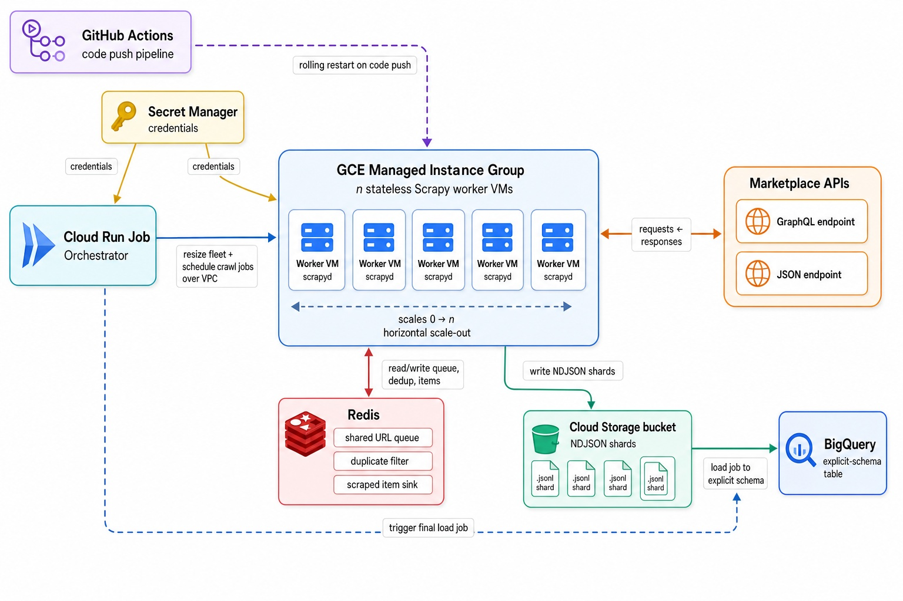

# shopping-scraper

**Full-catalog product extraction for Indonesian e-commerce, at fleet scale.**

A distributed scraping pipeline that walks the *entire* product catalog of [Tokopedia](https://www.tokopedia.com) and [Blibli](https://www.blibli.com) — category tree to individual SKU variants — and lands it in BigQuery as a single normalized table.

<p>
  
  
  
  
  
</p>

---

## The problem

Marketplaces don't want you to have their catalog, and they don't have to block you to stop you — they just **cap pagination**.

| Marketplace | Page cap | Products/page | Max reachable per query |
|---|---|---|---|
| Tokopedia | 100 | 60 | **6,000** |
| Blibli | 20 | 40 | **800** |

A category with 400,000 products will happily serve you the same first 6,000 forever. Every naive crawler silently captures ~1.5% of the catalog and reports success.

## The solution: recursive price-window bisection

If you can't go deeper, go **narrower**. Every result set is filtered by a price window `[pmin, pmax]`. If the window returns more results than the page cap can reach, the window is split at its midpoint and each half is re-queried — recursively, until every leaf window fits under the cap. The union of the leaves is the complete catalog.

```
scrape(a, b):
    fetch(page=1, pmin=a, pmax=b)

    if total_pages > PAGE_CAP:
        if b is unbounded:          # the open-ended tail
            scrape(a*2, ∞)          # double the floor and retry
        else:
            mid = (a + b) / 2
            scrape(a, mid)          # ── split ──
            scrape(mid+1, b)
            return

    paginate to completion, emit every product URL

scrape(0, MAX)                      # the bounded body of the catalog
scrape(MAX, ∞)                      # the long tail of expensive items
```

Worked example (illustrative numbers):

```
price →  0 ──────────────────────────────────────────── MAX ─────── ∞
         │                                                │
    [0, MAX]  ✗ 412k results, cap is 6k                   │
         ├── [0, 5M]     ✗ 380k                           │
         │    ├── [0, 2.5M]   ✗ 210k                      │
         │    │    ├── [0, 1.2M]   ✓ 4.8k  ← harvested    │
         │    │    └── [1.2M, 2.5M] ✓ 5.9k  ← harvested   │
         │    └── [2.5M, 5M]  ✓ 3.1k  ← harvested         │
         └── [5M, MAX]   ✓ 2.2k  ← harvested         [MAX, ∞) ✓ 900
```

Implemented for both marketplaces:
[`spiders/tokopedia/discovery.py`](shopping/shopping/spiders/tokopedia/discovery.py) ·
[`spiders/blibli/discovery.py`](shopping/shopping/spiders/blibli/discovery.py)

---

## Architecture



### The three-stage DAG

Each marketplace runs the same pipeline. The **output queue of stage N is handed directly to stage N+1 as its start-URL key** — no intermediate re-push, no glue code.

```
  ┌────────────────────┐   ┌────────────────────┐   ┌────────────────────┐
  │  1 · CATEGORIES    │   │  2 · DISCOVERY     │   │  3 · PRODUCTS      │
  │  ── single VM ──   │   │  ── all VMs ──     │   │  ── all VMs ──     │
  │                    │──▶│                    │──▶│                    │
  │  walk the          │   │  price-window      │   │  batched API       │
  │  category tree     │   │  bisection         │   │  extraction        │
  └────────────────────┘   └────────────────────┘   └─────────┬──────────┘
                                                              │
       categories:items          discovery:items              ▼
             │                         │                 GCS ▸ BigQuery
             ▼ becomes                 ▼ becomes
     discovery:start_urls       products:start_urls
```

| Stage | Spider | Fan-out | Emits |
|---|---|---|---|
| 1 | `{market}_categories` | 1 VM | Leaf category slugs |
| 2 | `{market}_discovery` | all VMs | Product URLs / detail-API URLs |
| 3 | `{market}_products` | all VMs | `ProductItem`, one per SKU variant |

Spiders self-terminate when their queue drains (`max_idle_time`), which is what lets the orchestrator use a simple "schedule on every VM, then wait for every job" barrier.

---

## Engineering highlights

### No browsers. Ever.
Rather than driving headless Chrome, the pipeline speaks the marketplaces' own internal protocols:

- **Tokopedia** — POSTs the genuine `PDPGetLayoutQuery` operation to `gql.tokopedia.com` with full fragments (`ProductVariant`, `ProductMedia`, `ProductHighlight`, `ProductDetail`) and the `x-tkpd-akamai: pdpGetData` header. See [`tokopedia_pdp_query.gql`](shopping/shopping/queries/tokopedia_pdp_query.gql).
- **Blibli** — hits `backend/search/products` and `backend/product-detail/products/{id}/_summary` directly.
- **Where no API exists** — the category tree and search pages are read by extracting Tokopedia's Apollo client cache (`window.__cache`) straight out of the page's inline script (`utils.get_cache`).

The headless-browser route was built and benchmarked first — [`undetectable_playwright_test.py`](shopping/undetectable_playwright_test.py) is what's left of it. The API approach won by orders of magnitude.

### Request coalescing
`TokpedGQL.merge_requests()` packs `REQUEST_CUE` (32) GraphQL operations into a **single array-bodied POST**, and `parse_split()` demultiplexes the array response back to per-item callbacks with their original `cb_kwargs` intact. 32 product detail pages per HTTP round trip.

```python
# shopping/gql.py
def merge_requests(self, requests):
    """Merge request bodies by taking the other parameters from the first request"""
    body = [json.loads(r.body) for r in requests]
    return requests[0].replace(
        body=json.dumps(body),
        cb_kwargs={'args': [r.cb_kwargs for r in requests]},
    )
```

### Fingerprint evasion where it's needed
Blibli fronts its API with TLS-fingerprint bot detection, so those spiders swap in `scrapy_impersonate` download handlers and request a real Chrome JA3 signature via `meta={"impersonate": "chrome"}`. Add rotating user agents (`ua_generator`) and per-request cookiejar isolation.

### Horizontal scale with no coordination code
`scrapy-redis` supplies the scheduler queue, the cross-VM duplicate filter, *and* the item sink from one Redis instance. Workers are shared-nothing and interchangeable — scaling the crawl is literally `resize_instance_group(n)`. Each VM writes its own `.jl` shard to GCS (`FEED_URI` injected per-VM at schedule time), so there is no write contention on the way out either.

### Tuned for throughput
`CONCURRENT_REQUESTS` runs at 256 globally and **1024** for `tokopedia_products`, with `REACTOR_THREADPOOL_MAXSIZE=400`, zero download delay, DNS caching and compression on.

### Zero-ops deployment
`git push` → GitHub Actions issues a `rolling-action restart` on the MIG → each VM boots [`startup-script.sh`](startup-script.sh), re-pulls the repo, rebuilds the venv, pulls secrets from Secret Manager by version URI, starts `scrapyd`, deploys the project egg, and configures an nginx reverse proxy for ScrapeOps telemetry. No image builds, no config drift, no secrets in git.

---

## Data model

Every marketplace normalizes into one `ProductItem` and one BigQuery table, with variants exploded to one row per SKU.

| Field | Type | Notes |
|---|---|---|
| `name` | `STRING` (required) | Variant-specific where variants exist |
| `url` · `marketplace` | `STRING` (required) | |
| `price` · `strike_price` | `INTEGER` | IDR, minor units stripped |
| `options` | `REPEATED RECORD<key,value>` | Normalized variant axes (colour, size, …) |
| `categories` | `REPEATED STRING` | Full ancestry |
| `category_breadcrumb` | `STRING` | |
| `brand` · `shop_name` · `shop_domain` | `STRING` | |
| `stock` · `weight` | `INTEGER` / `STRING` | |
| `image_urls` | `REPEATED STRING` | Original-resolution |
| `rating` · `review_count` · `view_count` · `sale_count` | `FLOAT` / `INTEGER` | Demand signals |

Schema: [`functions/schema.py`](functions/schema.py) · Item: [`shopping/items.py`](shopping/shopping/items.py)

---

## Repository layout

```
├── functions/                  # Cloud Run Job — the orchestrator
│   ├── job.py                  #   tokopedia_main() / blibli_main() pipelines
│   ├── utils.py                #   MIG resize, scrapyd RPC, Redis, BigQuery load
│   ├── schema.py               #   BigQuery table schema
│   └── deploy-job.sh           #   gcloud run jobs deploy
├── shopping/                   # Scrapy project (deployed to every VM as an egg)
│   └── shopping/
│       ├── settings.py         #   secrets, Redis scheduler, concurrency
│       ├── gql.py              #   GraphQL client + request coalescing
│       ├── items.py            #   unified ProductItem
│       ├── utils.py            #   __cache extraction, price/URL parsing
│       ├── queries/            #   .gql operation documents
│       └── spiders/
│           ├── tokopedia/      #   categories · discovery · products
│           └── blibli/         #   categories · discovery · products
├── startup-script.sh           # VM bootstrap (cloned by the MIG template)
├── install-scrapeops.sh        # nginx reverse proxy for monitoring
├── mig-setup.sh                # MIG update policy
└── .github/workflows/          # push → rolling restart the fleet
```

---

## Running it

### Prerequisites

- A GCP project with Compute Engine, Cloud Run, Secret Manager, GCS and BigQuery enabled
- A Redis instance reachable from the VPC (Memorystore or self-hosted)
- Two Secret Manager secrets: `shopping-redis` (Redis URI) and `shopping-scrapeops-api-key`
- A GCS bucket for feed output, and a `shopping.products` BigQuery table
- A regional MIG named `shopping-scrapers` whose instance template runs `startup-script.sh`

### One-time setup

```bash
# Fleet update policy — recreate instances so they re-pull on restart
bash mig-setup.sh

# Deploy the orchestrator
cd functions && cp ../.env.mock .env.yaml   # then fill in real values
bash deploy-job.sh
```

### Kick off a crawl

```bash
bash functions/run-tokopedia-job.sh    # num_vms=4, dry_run=1
bash functions/run-blibli-job.sh       # num_vms=4, full run
```

Or directly, with any parameters you like:

```bash
gcloud run jobs execute tokopedia-pipeline \
  --update-env-vars marketplace=tokopedia,num_vms=16 \
  --tasks 1 --task-timeout 24h --region us-central1
```

### Configuration

Job-level, via environment variables:

| Variable | Purpose |
|---|---|
| `marketplace` | `tokopedia` \| `blibli` — selects the pipeline |
| `num_vms` | Fleet size; resizes the MIG before the crawl |
| `dry_run` | Truncate to 2 categories — smoke-test the full path cheaply |
| `main_category` | Root category URL to start the tree walk from |
| `INSTANCE_GROUP_NAME` · `REGION` · `PROJECT_ID` | Fleet targeting |
| `GCS_BUCKET` · `PROJECT_NAME` | Output destinations |
| `REDIS_SECRET_VERSION` · `SCRAPEOPS_SECRET_VERSION` | Secret Manager version URIs |

Crawl-level knobs live in [`shopping/shopping/settings.py`](shopping/shopping/settings.py) —
`CONCURRENT_REQUESTS`, `REQUEST_CUE` (GraphQL batch size), `MAX_IDLE_TIME_BEFORE_CLOSE`.

### Operating a live crawl

Each VM's scrapyd API is reverse-proxied to port 80 on its internal IP:

```bash
curl http://<vm-internal-ip>/daemonstatus.json
curl "http://<vm-internal-ip>/listjobs.json?project=shopping"
```

`shopping/scrapydweb_settings_v10.py` ships a [ScrapydWeb](https://github.com/my8100/scrapydweb) config for a dashboard across the fleet, and the ScrapeOps extension reports per-spider request/item/error rates.

---

## Roadmap

Known gaps, roughly in priority order:

- **Temporal columns.** Rows carry no `scraped_at` or `run_id`, and loads are `WRITE_APPEND` with no dedupe key — so reruns stack and price history can't be reconstructed. This is the single highest-value change: it turns a snapshot into a time series.
- **Cross-VM URL dedup.** `DuplicatesUrlPipeline` keeps an in-process `set()`, so the same URL discovered on two VMs survives twice. Should be a Redis `SET` or delegated to the shared dupefilter.
- **Real job status.** `wait_for_jobs()` polls scrapyd's `finished` list, which cannot distinguish "completed" from "crashed on request 3". Pair it with a spider-close signal that records item counts and exit reason.
- **Timeouts and partial failure.** The wait loop has no deadline; one wedged spider hangs a 24-hour job. A per-stage timeout plus continue-on-partial-failure would make long crawls survivable.
- **Item-count alerting.** The classic scraper failure is `200 OK` with zero items after a site redesign. Alert on per-category yield deviating from the trailing baseline.
- **Schema-drift validation.** Marketplace response changes surface as a BigQuery load error *hours* into a crawl. Validate a sample early and fail fast.
- **Automate Blibli's category tree.** It's currently seeded from a hand-captured HTML snapshot in GCS because the page needs a real browser — a one-off Playwright step could refresh it per run.
- **Testability.** `settings.py` calls Secret Manager at import time, so nothing runs offline. Lazy-load secrets behind a local `.env` fallback, then add fixture-driven parser tests — response shapes are the thing most likely to break.
- **Housekeeping.** Pin all dependencies; move the checked-in `blibli_out.csv` / `blibli_categories.html` artifacts to GCS; drop the dead `read_gcs_file()` and `TokpedGQL.convert()`; migrate `FEED_URI` to the modern `FEEDS` setting.
- **More marketplaces.** The three-stage DAG and unified schema are already marketplace-agnostic — Shopee and Lazada are mostly new discovery/product spiders.

---

## Responsible use

This project is published for research and educational purposes. It reads only publicly accessible catalog data, but it does not honour `robots.txt` and it impersonates browser fingerprints. Before pointing it at anything:

- Review the target's Terms of Service and your local law
- Rate-limit to a level the target can absorb — the throughput settings here are aggressive by default
- Collect no personal data; product listings are not people
- Don't republish scraped content in ways that infringe copyright

You are responsible for how you use it.

## License

No license has been specified. All rights reserved by default — add one before sharing or reuse.
